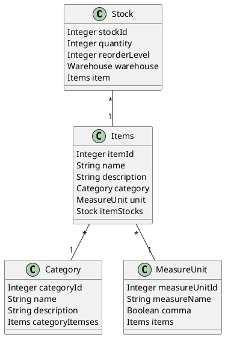

# Springboot entity and enum diagram generator

This script generates PlantUML diagrams from Java files by parsing entity classes, relationships, and enums.

## Features
- Detects classes annotated with `@Entity`.
- Extracts fields, relationships (e.g., `@OneToMany`, `@ManyToOne`), and enums.
- Generates a PlantUML diagram that can be rendered using PlantUML tools.

## Requirements
- Python 3.7 or higher.

## Installation
1. Clone the repository:
   ```bash
   git clone https://github.com/yourusername/plantuml-maker.git
   cd plantuml-maker
   ```

2. Ensure the input directory is accessible and contains Java files.
## Usage
1. Change input_directory variable:
   ```bash
   # 👇 Hardcoded path here
   input_directory = r"path\to\your\java\directory"  # Change this to your Java directory
   ```

2. Run the python script the way you prefer

## Output
The script generates a `plant.txt` file containing the PlantUML diagram. You can use any PlantUML rendering tool to visualize the diagram.

## Example Output
Here’s an example of the generated PlantUML diagram:


## License
This project is licensed under the MIT License. See the `LICENSE` file for details.

## Contributing
Contributions are welcome! Feel free to open issues or submit pull requests to improve the tool.
